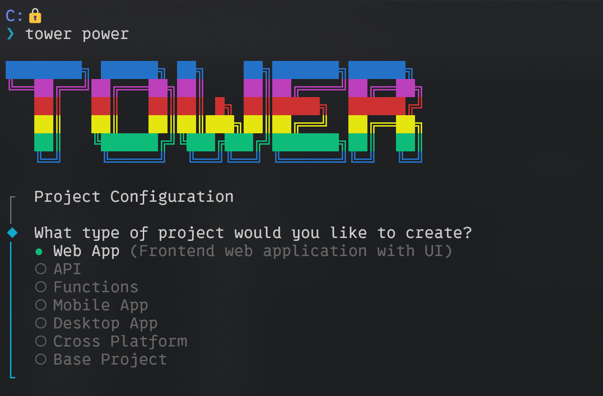
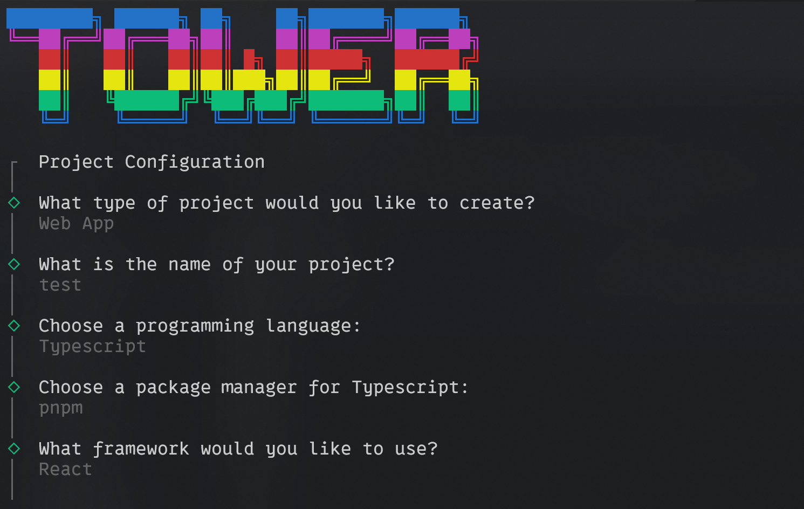
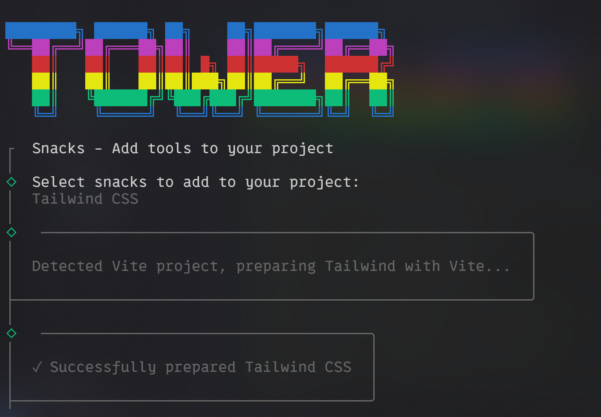

# Tower

A CLI tool to scaffold anything: script to startup

I've paused this project for now as I'm still ironing out the usability and maintainability. At the moment I'm still working on the idea in my [Alchemy Repo](https://github.com/toastdave/alchemy)

I built out 2 commands: power and snacks

## Power

A starting point to scaffold any project (web, mobile, desktop, script) in any language (TS, Python, Go, C#, Java)

At the moment, has the ability to scaffold out Vite and NextJs web apps

## Snacks

Adding utilities into any project (styling libraries, ORM's, local DB's via Docker, editor settings, etc)

Styling libraries and local DB's are as far as I've gotten on this commands

## A Couple Extra Screenshots

